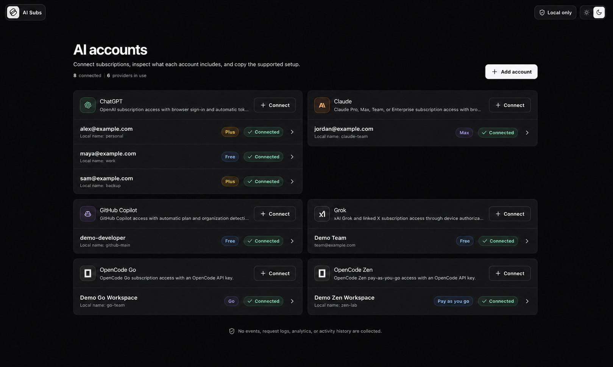
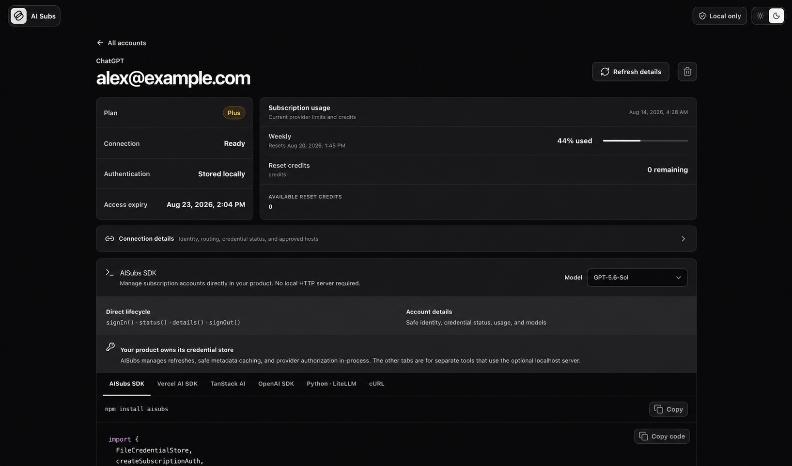
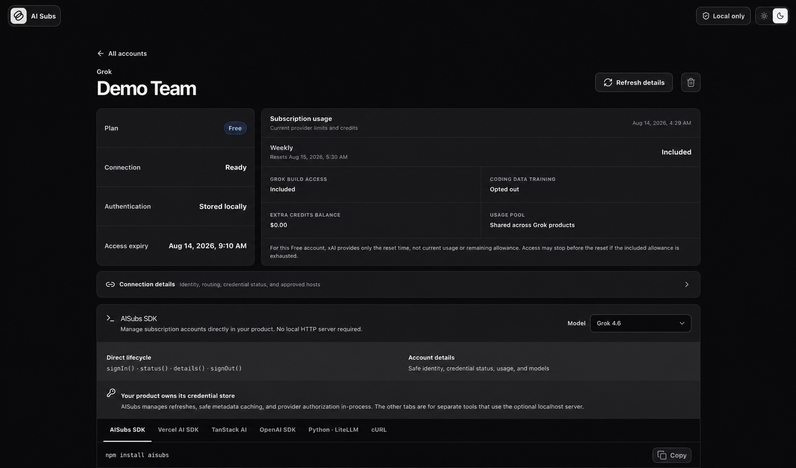
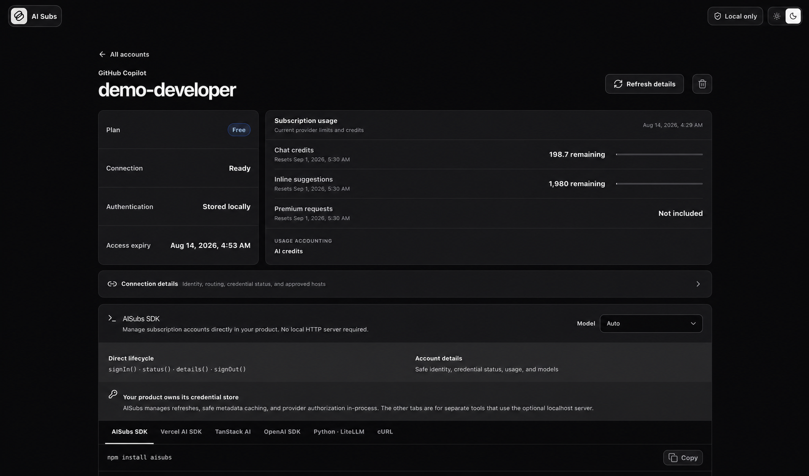

<table>
  <tr>
    <td></td>
    <td>
      <h1>AISubs</h1>
      <strong>Connect your AI subscriptions. Use them anywhere.</strong>
    </td>
  </tr>
</table>

Connect once, then use your subscriptions through an SDK in your app, a local
API, cURL, or any compatible tool.

<p align="center">
  
</p>

<p align="center">
  
  
  
</p>

> AISubs keeps credentials on your computer. It collects no telemetry, analytics, request logs, or activity history.

## Quick start

```bash
nubx aisubs dashboard       # Nub (recommended)
npx aisubs dashboard        # npm
pnpm exec aisubs dashboard  # pnpm
bunx aisubs dashboard       # Bun
```

Click **Add account**, choose a provider, complete sign-in, and give the
account a local name such as `personal` or `work`.

## The idea

1. Connect a provider account and give it a local name, such as `personal`.
2. Ask AISubs which models and request format that account supports.
3. Send the provider-native request through that account.

One provider can have many accounts:

```text
ChatGPT / personal
ChatGPT / work
Claude  / team
```

AISubs never silently switches accounts. Your application chooses the account
for each request.

## Providers

| Provider       | ID             | Sign-in                | Request format              |
| -------------- | -------------- | ---------------------- | --------------------------- |
| ChatGPT        | `chatgpt`      | Browser or device code | Responses                   |
| Claude         | `claude`       | Browser                | Anthropic Messages          |
| GitHub Copilot | `copilot`      | Device code            | Read from the model catalog |
| Grok           | `grok`         | Device code            | Read from the model catalog |
| OpenCode Go    | `opencode-go`  | API key                | Read from the model catalog |
| OpenCode Zen   | `opencode-zen` | API key                | Read from the model catalog |

Provider model lists and protocols can change. Discover models at runtime and
pin the AISubs version your application has tested.

## Fastest start: direct Node.js

This is the simplest integration. It needs no local server and no AISubs API
key.

### 1. Create AISubs once

```js
// subscriptions.js
import { chatGptProvider, createSubscriptionAuth } from "aisubs";

export const subscriptions = createSubscriptionAuth({
  providers: [chatGptProvider()],
});
```

By default, credentials are stored at `~/.aisubs/credentials.json`.

Keep this object in trusted backend code. Do not send it to a browser.

### 2. Connect an account

```js
import { subscriptions } from "./subscriptions.js";

const account = subscriptions.account("chatgpt", "personal");

if (!(await account.status()).authenticated) {
  const login = await account.signIn();

  if (login.prompt.mode === "browser") {
    console.log("Open:", login.prompt.authorizationUri);
  }
  if (login.prompt.mode === "device") {
    console.log("Open:", login.prompt.verificationUri);
    console.log("Code:", login.prompt.userCode);
  }

  await login.wait();
}
```

### 3. Discover a model and send a request

This example selects the first available ChatGPT model, so it does not depend
on a model ID that may change:

```js
const catalog = await account.getModels();
if (!catalog) throw new Error("This provider does not expose models");
console.log(
  "Available model IDs:",
  catalog.models.map((item) => item.id),
);

const modelId = catalog.models.find((item) => item.selectable !== false)?.id;
if (!modelId) throw new Error("No ChatGPT model is available");
console.log("Using model:", modelId);

const response = await account.proxy("responses", {
  method: "POST",
  headers: { "content-type": "application/json" },
  body: JSON.stringify({
    model: modelId,
    store: false,
    stream: true,
    input: "Hello from AISubs",
  }),
});

if (!response.ok) throw new Error(await response.text());
if (response.body) {
  for await (const chunk of response.body) process.stdout.write(Buffer.from(chunk));
}
```

Here, `modelId` is the exact ID returned by `account.getModels()`. Model IDs
belong to the connected provider account and can change, so list them first
instead of copying a fixed ID from documentation.

`store: false` is a request option for the Responses API; it is unrelated to
AISubs credential storage and keeps response storage disabled. `stream: true`
asks for incremental output, which is why the example reads `response.body` in
chunks. Keep both options for ChatGPT subscription Responses requests.

AISubs refreshes expired credentials automatically and retries a provider `401`
once.

<details>
<summary><strong>Use another provider</strong></summary>

Add its provider factory when creating AISubs:

```js
import {
  chatGptProvider,
  claudeProvider,
  copilotProvider,
  createSubscriptionAuth,
  grokProvider,
  openCodeGoProvider,
  openCodeZenProvider,
} from "aisubs";

const subscriptions = createSubscriptionAuth({
  providers: [
    chatGptProvider(),
    claudeProvider(),
    copilotProvider(),
    grokProvider(),
    openCodeGoProvider(),
    openCodeZenProvider(),
  ],
});
```

To use a different file, pass a custom store:

```js
import { chatGptProvider, createSubscriptionAuth, FileCredentialStore } from "aisubs";

const subscriptions = createSubscriptionAuth({
  store: new FileCredentialStore("./data/aisubs-credentials.json"),
  providers: [chatGptProvider()],
});
```

Then select the account by provider ID:

```js
const claude = subscriptions.account("claude", "team");
const copilot = subscriptions.account("copilot", "github");
const grok = subscriptions.account("grok", "personal");
const go = subscriptions.account("opencode-go", "team");
const zen = subscriptions.account("opencode-zen", "lab");
```

OpenCode uses an API key:

```js
const login = await go.signIn({ apiKey: process.env.OPENCODE_API_KEY });
await login.wait();
```

For ChatGPT on a headless machine, use `signIn({ mode: "device" })`. Copilot
also accepts `enterpriseDomain` for a supported GitHub Enterprise Cloud domain.

Provider request paths are:

| Model catalog endpoint | `account.proxy()` path            |
| ---------------------- | --------------------------------- |
| `responses`            | `responses`                       |
| `chat/completions`     | `chat/completions`                |
| `messages`             | `messages`                        |
| `models/MODEL_ID`      | `models/MODEL_ID:generateContent` |

Use `account.getModels()` first for Copilot, Grok, and OpenCode because one
provider can expose more than one request format.

</details>

<details>
<summary><strong>Read account, usage, and model information</strong></summary>

```js
const details = await account.details();

console.log(details.session); // connection state and safe account identity
console.log(details.credential); // expiry and refresh state, never token values
console.log(details.usage); // limits and reset information, or null
console.log(details.models); // available models, or null
```

Useful methods:

| Method                       | Purpose                                                |
| ---------------------------- | ------------------------------------------------------ |
| `account.status()`           | Check whether the account is connected                 |
| `account.signIn(options?)`   | Start a browser, device-code, or API-key login         |
| `account.signOut()`          | Remove this account's locally stored credentials       |
| `account.getModels()`        | Get the provider's current model catalog               |
| `account.getUsage()`         | Get current plan usage, if supported                   |
| `account.details()`          | Get safe session, credential, usage, and model data    |
| `account.fetch(url, init?)`  | Make an authorized request to an allowed provider URL  |
| `account.proxy(path, init?)` | Make a provider-native request without handling tokens |

`details()`, `getUsage()`, and `getModels()` never return access or refresh
tokens. `getAccessToken()` exists for advanced backend integrations; keep its
result secret and prefer `fetch()` or `proxy()` when possible.

</details>

<details>
<summary><strong>Use multiple accounts</strong></summary>

```js
const personal = subscriptions.account("chatgpt", "personal");
const work = subscriptions.account("chatgpt", "work");

const selected = user.isWorkAccount ? work : personal;
const response = await selected.proxy("responses", requestOptions);
```

Account names are 1–128 characters and cannot contain control characters.
Each account has separate credentials, refresh state, usage, and model data.

</details>

## Dashboard

### Requirements and installation

- [Node.js 24 or newer](https://nodejs.org/en/download/).
- A terminal and a browser for provider sign-in.
- [Nub 0.6 or newer](https://nubjs.com/docs/install) is recommended. It is not
  required; [pnpm](https://pnpm.io/installation),
  [npm](https://docs.npmjs.com/cli/install/), and
  [Bun](https://bun.sh/docs/installation) also work.
- An API key for OpenCode Go or OpenCode Zen; the other providers use browser
  or device-code sign-in.

Install AISubs in your project:

```bash
nub install aisubs       # Nub (recommended)
npm install aisubs       # npm
pnpm add aisubs          # pnpm
bun add aisubs           # Bun
```

Use the dashboard when you want to connect accounts without writing login UI:

```bash
nubx aisubs dashboard       # Nub (recommended)
npx aisubs dashboard        # npm
pnpm exec aisubs dashboard  # pnpm
bunx aisubs dashboard       # Bun
```

Then click **Add account**, choose a provider, finish sign-in, and choose a
local account name. The dashboard shows safe account details, usage, models,
and copy-ready integration examples.

By default, AISubs uses Node.js 24 or newer, listens on
`127.0.0.1:4319`, and stores credentials at `~/.aisubs/credentials.json`.

To use another directory, choose an available port, or prevent the browser
from opening:

```bash
nubx aisubs dashboard \
  --data-dir ./data/aisubs \
  --port 0 \
  --no-open
```

Use the equivalent `npx`, `pnpm exec`, or `bunx` command if you use npm, pnpm,
or Bun.

The dashboard prints the secure link when `--no-open` is used. Credentials stay
on your computer; do not commit the data directory or expose the dashboard to
the network.

Use `AISUBS_DATA_DIR` or `--data-dir` to choose another data directory. Use
`--port 0` for an available port and `--no-open` to print the secure link
without opening a browser.

## Local HTTP bridge

Use the bridge for an existing SDK, Python, cURL, or another program that
cannot import AISubs:

```bash
nubx aisubs dashboard       # Nub (recommended)
npx aisubs dashboard        # npm
pnpm exec aisubs dashboard  # pnpm
bunx aisubs dashboard       # Bun
export AISUBS_API_KEY="the-control-key-printed-by-aisubs"
```

The base URL chooses the provider and account. Append the provider's request
path shown by `getModels()` or the dashboard:

```text
http://127.0.0.1:4319/aisubs/chatgpt/personal/responses
http://127.0.0.1:4319/aisubs/claude/team/messages
http://127.0.0.1:4319/aisubs/grok/personal/chat/completions
```

The account name is URL-decoded by AISubs, so URL-encode names containing
spaces or other URL characters. AISubs removes the control key before sending
the request to a provider.

<details>
<summary><strong>Vercel AI SDK</strong></summary>

For a `responses` model:

```bash
nub install ai @ai-sdk/openai
```

```js
import { createOpenAI } from "@ai-sdk/openai";
import { streamText } from "ai";

const provider = createOpenAI({
  baseURL: "http://127.0.0.1:4319/aisubs/chatgpt/personal",
  apiKey: process.env.AISUBS_API_KEY,
});

const result = streamText({
  model: provider.responses("MODEL_ID"),
  prompt: "Hello",
  providerOptions: { openai: { store: false } },
});

for await (const text of result.textStream) process.stdout.write(text);
```

For `chat/completions`, use `@ai-sdk/openai-compatible`. For `messages`, use
`@ai-sdk/anthropic`. For OpenCode Zen Gemini, use the model-specific
`models/MODEL_ID:generateContent` URL shown in the dashboard.

</details>

<details>
<summary><strong>TanStack AI</strong></summary>

TanStack AI can use AISubs through its OpenAI-compatible adapter:

```bash
nub install @tanstack/ai @tanstack/ai-openai       # Nub (recommended)
npm install @tanstack/ai @tanstack/ai-openai       # npm
pnpm add @tanstack/ai @tanstack/ai-openai          # pnpm
bun add @tanstack/ai @tanstack/ai-openai           # Bun
```

```ts
import { chat } from "@tanstack/ai";
import { openaiCompatibleText } from "@tanstack/ai-openai/compatible";

const stream = chat({
  adapter: openaiCompatibleText("MODEL_ID", {
    baseURL: "http://127.0.0.1:4319/aisubs/grok/personal",
    apiKey: process.env.AISUBS_API_KEY!,
  }),
  messages: [{ role: "user", content: "Hello" }],
});

for await (const chunk of stream) {
  if (chunk.type === "TEXT_MESSAGE_CONTENT") process.stdout.write(chunk.delta);
}
```

Use the equivalent `npm install`, `pnpm add`, or `bun add` command if you use
another package manager. Replace the provider, account, and model with values
from your dashboard.

</details>

<details>
<summary><strong>OpenAI, Anthropic, Python, or cURL</strong></summary>

OpenAI Responses:

```bash
nub install openai
```

```js
import OpenAI from "openai";

const client = new OpenAI({
  baseURL: "http://127.0.0.1:4319/aisubs/chatgpt/personal",
  apiKey: process.env.AISUBS_API_KEY,
});

const stream = await client.responses.create({
  model: "MODEL_ID",
  store: false,
  stream: true,
  input: "Hello",
});

for await (const event of stream) console.log(event);
```

Anthropic Messages uses `@anthropic-ai/sdk` with this base URL:

```text
http://127.0.0.1:4319/aisubs/claude/team
```

Chat Completions with LiteLLM:

```bash
pip install litellm
```

```python
import os
from litellm import completion

response = completion(
    model="openai/MODEL_ID",
    api_base="http://127.0.0.1:4319/aisubs/grok/personal",
    api_key=os.environ["AISUBS_API_KEY"],
    messages=[{"role": "user", "content": "Hello"}],
    stream=True,
)

for event in response:
    print(event)
```

cURL:

```bash
curl "http://127.0.0.1:4319/aisubs/chatgpt/personal/responses" \
  -H "Authorization: Bearer $AISUBS_API_KEY" \
  -H "Content-Type: application/json" \
  -d '{"model":"MODEL_ID","store":false,"stream":true,"input":"Hello"}'
```

For Messages, use `x-api-key: $AISUBS_API_KEY` and
`anthropic-version: 2023-06-01`.

</details>

<details>
<summary><strong>Run a server from Node.js</strong></summary>

HTTP bridge without the dashboard:

```js
import { randomBytes } from "node:crypto";
import { chatGptProvider, createSubscriptionAuth, FileCredentialStore } from "aisubs";
import { createSubscriptionAuthServer } from "aisubs/http";

const auth = createSubscriptionAuth({
  store: new FileCredentialStore("./data/aisubs-credentials.json"),
  providers: [chatGptProvider()],
});

const server = await createSubscriptionAuthServer({
  auth,
  apiKey: randomBytes(24).toString("hex"),
  port: 4319,
});

console.log(server.url);
// await server.close();
```

Dashboard inside a Node.js application:

```js
import { createSubscriptionAuthDashboardServer } from "aisubs/dashboard";

const dashboard = await createSubscriptionAuthDashboardServer({ auth });
console.log(dashboard.bootstrapUrl);
// await dashboard.close();
```

Both servers bind only to localhost. The programmatic HTTP server requires its
API key; the dashboard also provides a one-time browser link.

</details>

<details>
<summary><strong>Local HTTP API</strong></summary>

```text
GET    /health
GET    /v1/providers
GET    /v1/auth
GET    /v1/auth/:provider
GET    /v1/auth/:provider/accounts
POST   /v1/auth/:provider/login
GET    /v1/logins/:loginId
DELETE /v1/logins/:loginId
GET    /v1/auth/:provider/details?account=work
DELETE /v1/auth/:provider?account=work
POST   /v1/fetch/:provider
GET    /v1/usage/:provider?account=work
GET    /v1/models/:provider?account=work
*      /aisubs/:provider/:account/*
```

The dashboard's `/bootstrap` link is one-time. Other routes require the
control API key or dashboard session cookie. Login responses return an attempt
ID; poll `/v1/logins/:loginId` until it is complete, failed, or cancelled.

</details>

<details>
<summary><strong>Storage and security</strong></summary>

- Default credentials: `~/.aisubs/credentials.json`.
- Override the directory with `AISUBS_DATA_DIR` or `--data-dir`.
- `FileCredentialStore` creates private directories/files and uses file locks.
- `MemoryCredentialStore` is available for tests and temporary processes.
- Usage is cached for 15 seconds; model catalogs are cached for five minutes.
- Sign-in, refresh, and sign-out clear the affected metadata cache.
- Provider credentials are added only after host allowlist validation.
- Local auth and control-key headers are removed before forwarding.
- Account APIs return safe summaries, never token values.
- Never expose provider credentials or `AISUBS_API_KEY` in browser code.

</details>

<details>
<summary><strong>Local development</strong></summary>

From the package directory, run:

```bash
nub run dev
```

Equivalent commands are `pnpm dev`, `npm run dev`, and `bun run dev`. Nub is
recommended, but it is not required. The command builds the package once,
watches backend and dashboard changes, and opens the local dashboard. Pass
`-- --no-open` to keep the browser closed.

</details>

<details>
<summary><strong>Maintainer pre-publish check</strong></summary>

```bash
nub run check
nub pack --dry-run
```

With another package manager, use `pnpm check` / `pnpm pack`,
`npm run check` / `npm pack --dry-run`, or `bun run check` / `bun pm pack`.

Confirm that the package contains `dist`, `examples`, `public`, `README.md`,
`LICENSE`, and the README logo asset. Test at least one real account for every
provider your release claims to support.

Runnable examples:

- [`examples/direct.mjs`](./examples/direct.mjs)
- [`examples/server.mjs`](./examples/server.mjs)

</details>

## Contributing and bug reports

Please read [`CONTRIBUTING.md`](./CONTRIBUTING.md) before opening an issue or
pull request. To report a reproducible bug, use the
[Bug report form](./.github/ISSUE_TEMPLATE/bug_report.yml) and include the
version, environment, steps to reproduce, expected and actual behavior, and
sanitized error output where relevant.

## License

AISubs is licensed under the [MIT License](./LICENSE).
